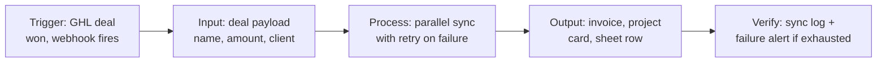

# Proposal: GoHighLevel (GHL) + Make.com Automation Expert

## 1. Demo Link

**Live demo:** https://ghl-makecom-deal-sync-demo.streamlit.app/
**Repo:** https://github.com/PureGit90/ghl-makecom-deal-sync-demo

Built a working simulation of the exact sync you described, deal won in GHL fanning out to invoicing, project management, and reporting, with retry and failure alerts built in.

## 2. Hook

You said your invoicing platform, project board, and Google Sheets reporting don't connect natively to GHL, so data moves by hand. I built a pipeline that takes a "deal won" event and creates the invoice, the project card, and the sheet row automatically, with retry logic and a visible failure log if any step doesn't land the first time.

## 3. Demo Reference

- Submit a mock deal and watch all three systems get updated with the resulting record IDs
- Check "simulate a step failure" and watch the retry kick in live, with a step-by-step log showing exactly what happened and when
- A second section demos the reverse sync too: marking an invoice paid and syncing that status back to GHL
- Screenshot attached

## 4. Architecture Breakdown

**Trigger:** GHL deal marked won, webhook fires
**Input:** Deal payload (name, amount, client)
**Processing:** Parallel sync to invoicing, project board, and sheet, with retry on failure
**Output:** Invoice created, project card created, sheet row logged, payment status synced back to GHL
**Verification:** Step-by-step sync log with per-step success/retry status, and a failure alert if retries run out

## 5. Tech Stack & Timeline

**Stack:** Make.com scenarios, GHL API, webhooks, HTTP modules
**Timeline:** 3-5 days for the full scenario live against your actual invoicing, project management, and Sheets accounts
**What you get:**
- The live Make.com scenario (not n8n, built in the tool you actually run), with the same retry/error-handling logic shown in the demo
- A2P 10DLC registration and email domain setup handled as part of the build
- Documentation of every scenario plus a short handover session

## 6. Pricing

**$190 fixed**, within your posted range, for the deal-won sync scenario end to end: invoicing, project board, sheet logging, error handling, and payment status syncing back to GHL.

Ready to start this week. Can you share API access to your invoicing and project management tools once we kick off, or do those need to be set up first?
