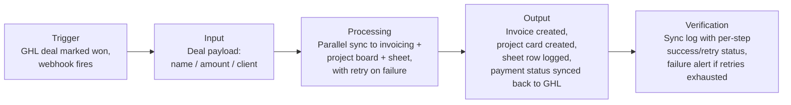

# Workflow: Deal-Won Sync Pipeline with Error Handling

```mermaid
graph LR
    A["Trigger<br/>GHL deal marked won,<br/>webhook fires"] --> B["Input<br/>Deal payload:<br/>name / amount / client"]
    B --> C["Processing<br/>Parallel sync to invoicing +<br/>project board + sheet,<br/>with retry on failure"]
    C --> D["Output<br/>Invoice created,<br/>project card created,<br/>sheet row logged,<br/>payment status synced back to GHL"]
    D --> E["Verification<br/>Sync log with per-step<br/>success/retry status,<br/>failure alert if retries exhausted"]
```
